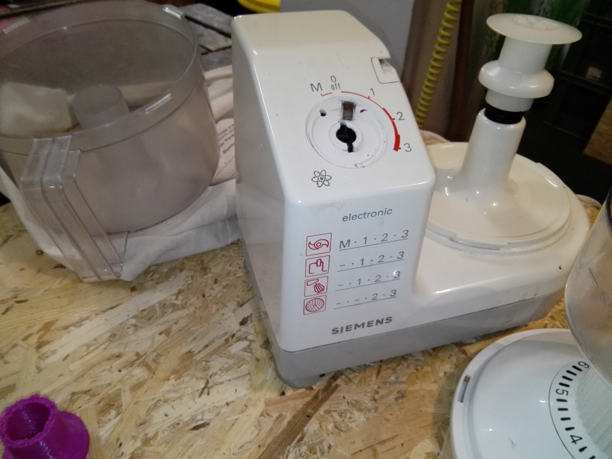
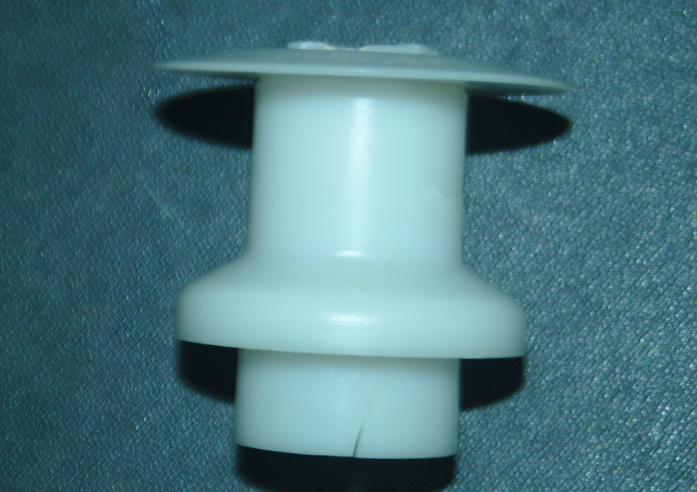
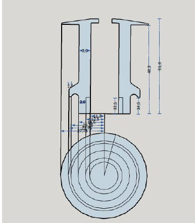
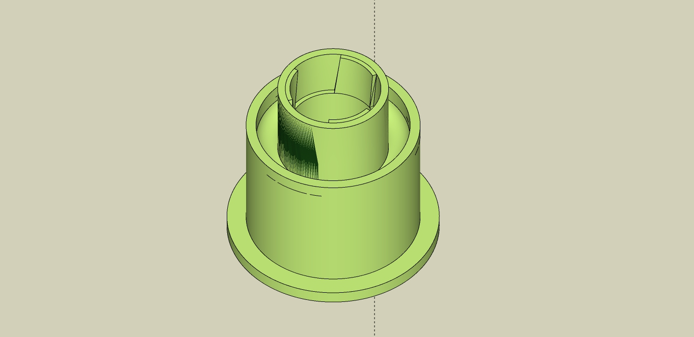
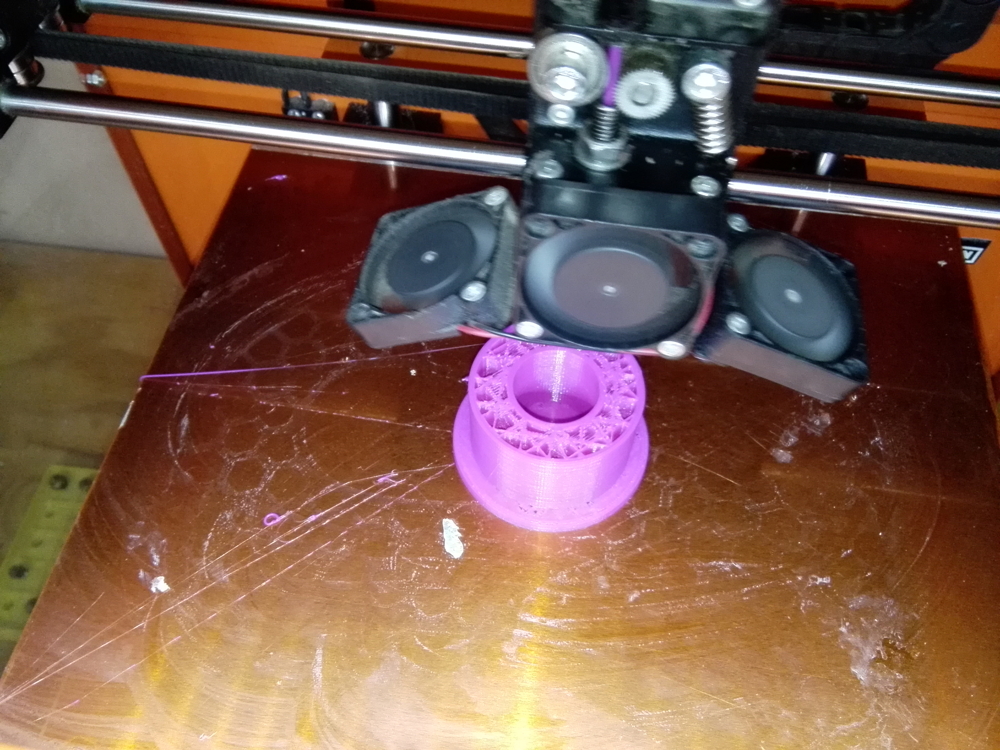
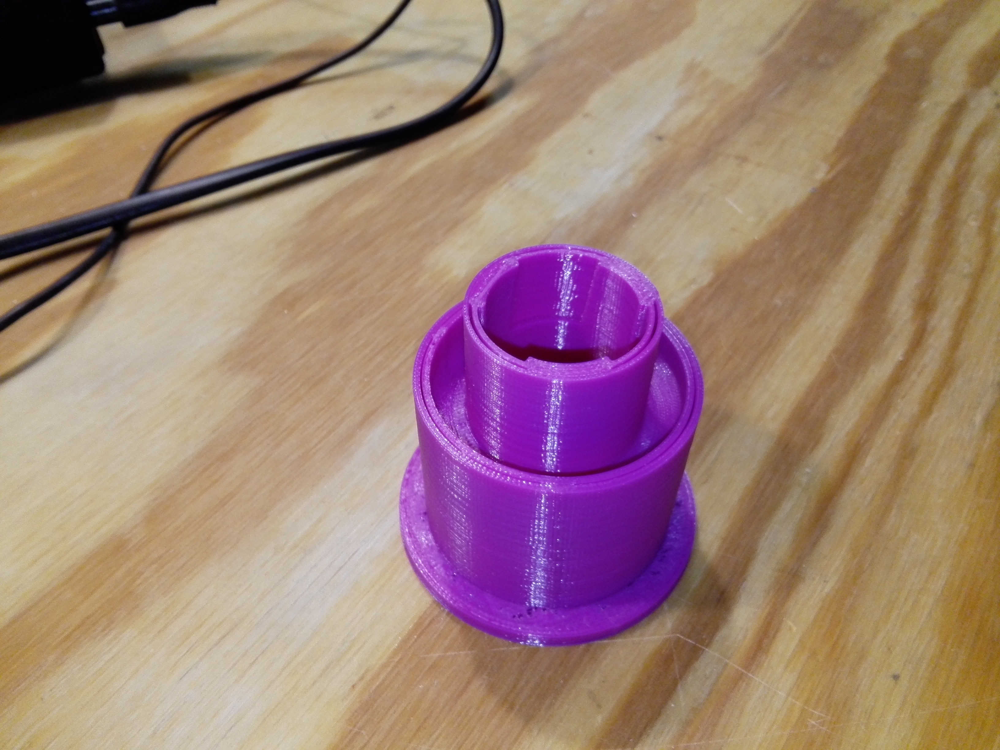

# Ersatzteil fuer ein Siemens MK14050 Küchenmaschine

Im Rahmen eines **Repair-Cafes** im Bootshaus bei den **Naturfreunden** München hat mich ein Freund gebeten ein Ersatzteil für seine Küchenmaschine zu konstruieren und zu drucken.

Mit unseren Möglichkeiten im 
[erfindergarden](http://www.erfindergarden.de "erfindergarden") sollte das kein Problem sein.

Ich habe dann zuerst einmal eine grobe Skizze angefertigt und mir die Maße eintragen lassen

Mit den Maßen konnte ich dann ein exates Modell mit Hilfe von **SketchUp** anfertigen.

Wir haben das original Modell dann doch etwas abgeändert und die Form für das 3D-Drucken optimiert. So war kein Stützmaterial nötig und die Energieübertragende **Verzahnung** wurde verstärkt.

Vorab gab es noch einen Probedruck um die **Passgenauigkeit der Verzahnung** zu überprüfen.

Hier dann der finale Druck, der etwa 2,5 Stunden gedauert hat.

Im Rahmen des Projekts habe ich ein Tutorial in drei Teilen erstellt. Den Link zu den **Tutorials auf youtube** gibt es hier:

**Teil 1**: https://youtu.be/MmmyXsBOFyE

**Teil 2:** https://youtu.be/vadg7nbgxD0

**Teil 3:** https://youtu.be/obfeLnm1DDc

